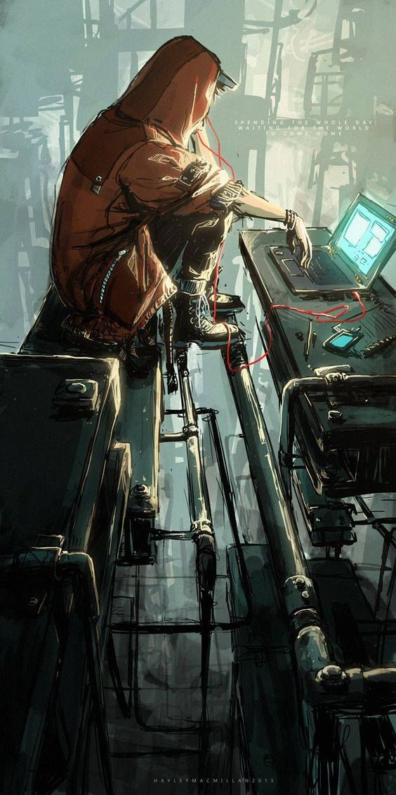

### Hi friend 👋

 A highly motivated Software Engineer, developing a wide range of tools for both iOS and Android, an Electronic Engineer graduate with a 3.2 GPA from __Turkish Air Force Academy__ , currently looking to resume my professional career after dedicating the last nine years to flying in service of air forces. Understanding the mobile app project lifecycle in depth and open to learning at all aspects of development from project planning to requirements gathering through to writing code, creating documentation and support, currently seeking long-term contract positions which will allow me to further improve my project management skills

## What I'm trying to learn and improve
 	* Programming languages including: HTML 5, CSS, PYTHON, JAVASCRIPT, REACT-NATIVE, SQL
 	* Developed and designed projects which was built and deployed in React-Native
    * Restfull API
 	* Redux
 	* GIT and GITHUB 
 	* Familiar with Agile and Scrum working methods
 	* SDLC (Software Development Life Cycle)
 	* Visual Studio / Jupiter Lab
 	* Confident building and optimising development processes

  

### Talk to me (click on for visit)

 *   

 *    
 

